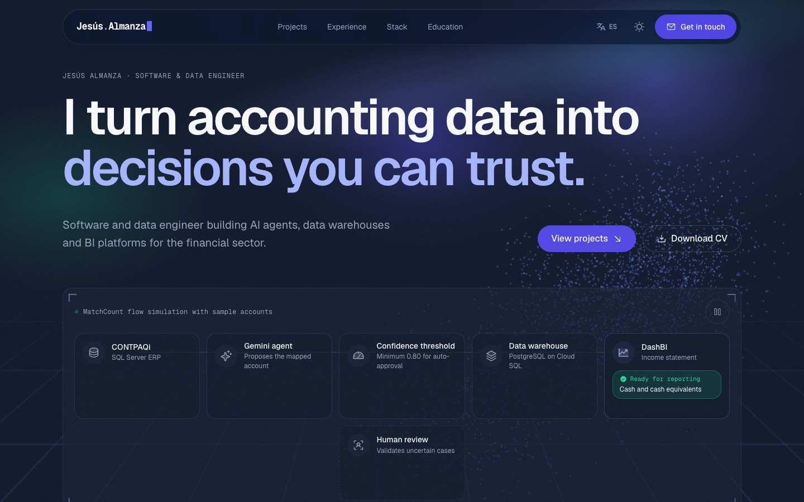

# Jesús Almanza · Software & Data Engineer

[](https://github.com/JAlcon00/JesusAlmanzaCVWeb/actions/workflows/ci.yml)

Personal portfolio of **Jesús Almanza**, software and data engineer and IT Manager at Olson Capital. The site presents his work building AI-powered accounting-data pipelines, cloud data warehouses and BI backends for the financial sector.

Bilingual (English / Spanish), static, and built with Astro, Tailwind CSS v4, React islands and Three.js.



## Highlights

- **3D data core.** A fixed Three.js particle system that rotates as you scroll and changes shape by section: a chaotic cloud (raw ERP data), an ordered cube (the data warehouse) and a bar chart (decisions). It loads lazily after the page is visible.
- **Interactive demos.** A live simulation of the MatchCount pipeline (ERP → Gemini agent → confidence threshold → human review → data warehouse → DashBI) and a confidence-threshold slider that routes sample accounts to automatic approval or human review.
- **Scroll storytelling.** Reading-progress bar and active section in the nav, layered hero, word-by-word headings, count-up metrics, a timeline that draws itself and images that reveal with parallax. Built with CSS scroll-driven animations and `IntersectionObserver`, with no scroll listeners.
- **Bilingual by design.** English at `/` and Spanish at `/es/` via Astro i18n routing, with `hreflang` alternates and a typed content contract so neither language can miss a string.
- **Light and dark themes.** It follows the system preference and has a manual toggle. The palette keeps WCAG AA contrast in both themes.
- **Accessible.** Semantic landmarks, skip link, visible focus, labelled controls, and `prefers-reduced-motion` respected everywhere (the 3D core renders as a still frame).

## Tech stack

| Layer | Choice |
|---|---|
| Framework | [Astro 7](https://astro.build) (static output) |
| Styling | [Tailwind CSS v4](https://tailwindcss.com) with CSS custom-property tokens |
| Interactivity | React 19 islands + [Motion](https://motion.dev) |
| 3D | [Three.js](https://threejs.org) |
| Icons | [Phosphor Icons](https://phosphoricons.com) · tech logos from [Simple Icons](https://simpleicons.org) |
| Typography | [Geist and Geist Mono](https://vercel.com/font) (self-hosted via Fontsource) |

## Getting started

Requires **Node.js 22.12 or newer** (the repository pins Node 24 in `.nvmrc`; run `nvm use` if you use nvm).

```bash
git clone https://github.com/JAlcon00/JesusAlmanzaCVWeb.git
cd JesusAlmanzaCVWeb
npm install
npm run dev
```

The site runs at http://localhost:4321 (English) and http://localhost:4321/es/ (Spanish).

| Command | What it does |
|---|---|
| `npm run dev` | Starts the development server |
| `npm run build` | Type-checks with `astro check` and builds the static site into `dist/` |
| `npm run preview` | Serves the production build locally |
| `npm run check` | Type-checks only |
| `npm run format` | Formats the code with Prettier (Astro and Tailwind plugins) |
| `npm run format:check` | Verifies formatting without changing files (used in CI) |

Every push and pull request to `main` runs the [CI workflow](.github/workflows/ci.yml): clean install, formatting check, type-check and production build. Dependabot opens weekly grouped updates for npm packages and monthly ones for GitHub Actions.

## Project structure

```text
src/
├── i18n/            All site copy: types.ts (contract), en.ts, es.ts, shared.ts
├── components/      Page sections (.astro) and visual building blocks
│   └── islands/     Interactive React components (pipeline, threshold demo, copy email)
├── lib/             dataCore.ts (Three.js scene) and scene image helpers
├── layouts/         Base.astro: head, SEO, JSON-LD, theme and global scripts
├── pages/           index.astro (English) and es/index.astro (Spanish)
├── styles/          global.css: design tokens, textures and scroll animations
└── assets/          Portrait and scene images, optimized at build time
public/              Favicon, robots.txt and the downloadable CV
docs/                README preview image and brand palette reference
.github/             CI workflow and Dependabot configuration
```

## Editing content

All visible text lives in `src/i18n/en.ts` and `src/i18n/es.ts`. Both files must satisfy the `SiteContent` type in `src/i18n/types.ts`, so the build fails if a string is missing in either language.

- **Portrait:** replace `src/assets/portrait.png` with another transparent PNG.
- **Section images:** add or replace files in `src/assets/scenes/`. Missing images are simply not rendered.
- **Downloadable CV:** replace `public/cv/Jesus-Almanza-CV.pdf`.

Design, motion and accessibility rules for contributors (human or AI) are documented in [`agent.md`](agent.md). Project context and the decision log are in [`context.md`](context.md). Both are written in Spanish.

## Deployment

`npm run build` outputs a fully static site in `dist/`, deployable to any static host (Vercel, Netlify, Cloudflare Pages or GitHub Pages).

Before deploying, set your final domain in `astro.config.mjs` (`site`) and in `public/robots.txt`. The domain is used for canonical URLs, `hreflang` links and the sitemap.

## Credits

- Section images generated with Canva AI.
- Icons by [Phosphor Icons](https://phosphoricons.com) (MIT). Technology logos by [Simple Icons](https://simpleicons.org) (CC0).
- Geist and Geist Mono fonts by Vercel (SIL Open Font License).

## License

© 2026 Jesús Almanza. All rights reserved. The code, content, portrait and CV in this repository may not be reused without permission. See [LICENSE](LICENSE).
